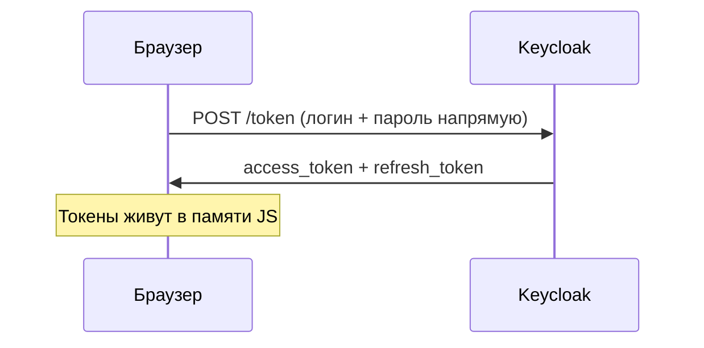
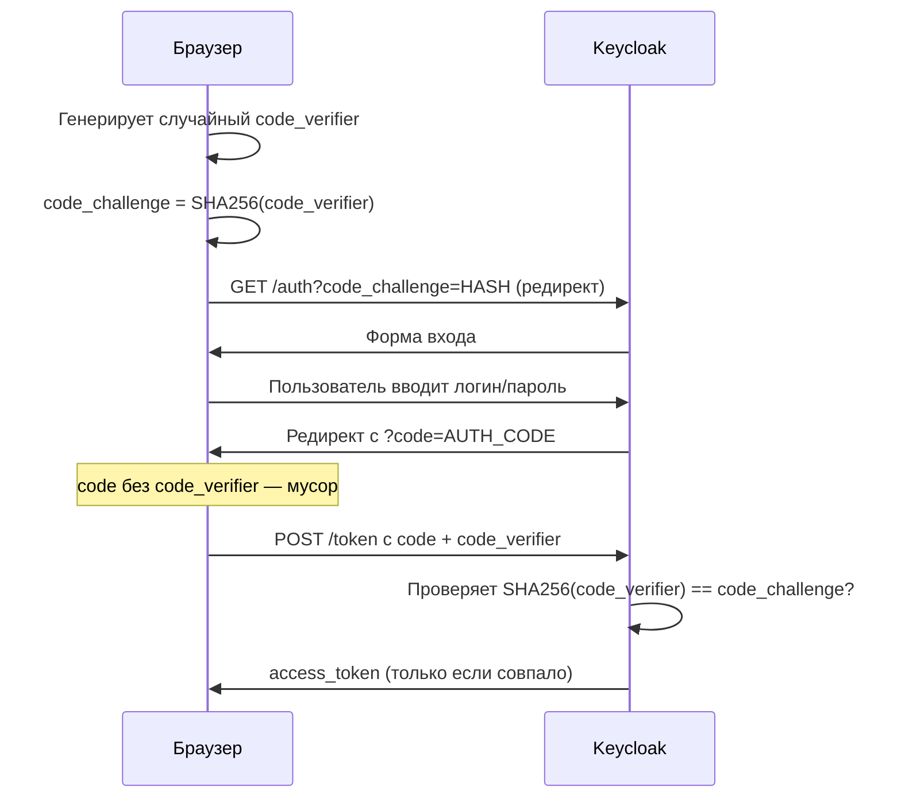
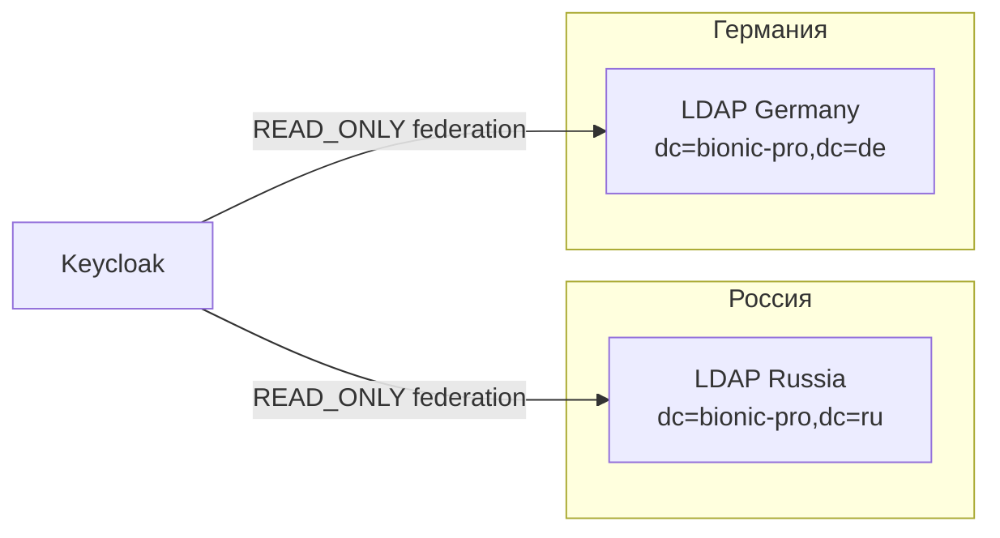
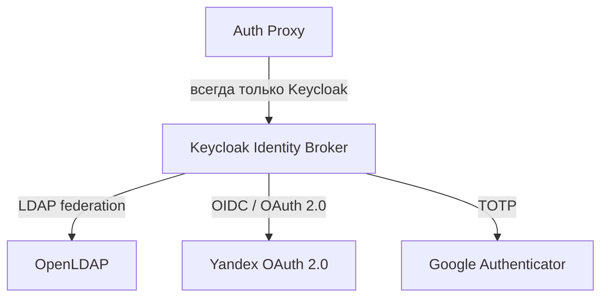
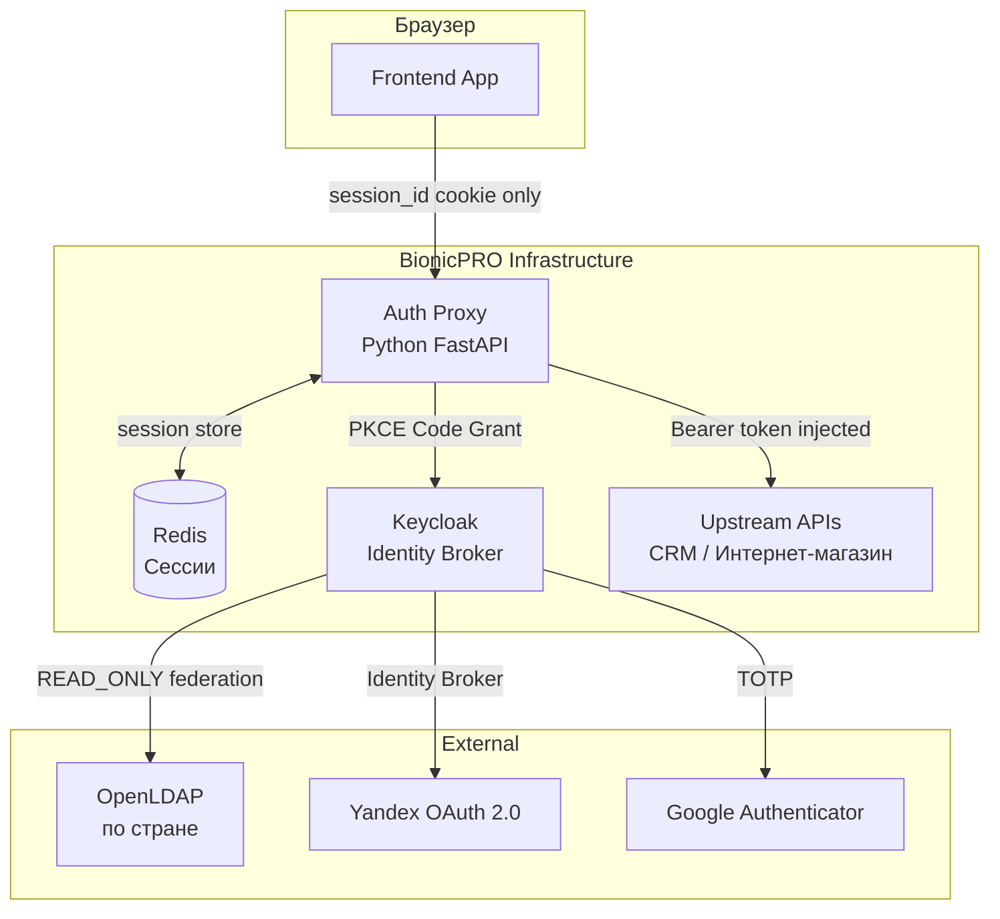

# Задание 1. Повышение безопасности системы

## Задача 1. Предложите архитектурное решение и доработайте диаграмму C4 для управления учётными данными пользователя.

---

## Проблема

Компания BionicPRO была взломана, несмотря на использование OAuth 2.0 Code Grant через Keycloak. Хакеры получили доступ к персональным данным пользователей по всем протезам. Анализ текущей конфигурации выявил следующие уязвимости:

- В Keycloak включён `directAccessGrantsEnabled: true` — это позволяет клиенту получать токены напрямую, минуя браузерный редирект (Resource Owner Password Credentials Grant). Пароль пользователя передаётся непосредственно в JS-приложение.
- PKCE не настроен — authorization code можно перехватить и обменять на токен без `code_verifier`.
- `access_token` и `refresh_token` хранятся в памяти браузера. При XSS-атаке они доступны злоумышленнику.
- Все учётные данные пользователей хранятся локально, без учёта требований законодательства разных стран к хранению персональных и медицинских данных.
- Отсутствует поддержка внешних удостоверяющих служб для работы в других странах.

### Как именно произошёл взлом

В текущей системе браузер работает так:



Два критичных изъяна:

1. **ROPC-грант** (`directAccessGrantsEnabled: true`) — JS-приложение само отправляет пароль пользователя напрямую в Keycloak. Никакого редиректа в браузере, никакой проверки «кто реально запросил токен». Любое вредоносное приложение, притворившееся вашим, может делать то же самое.
2. **Токены в браузере** — `access_token` живёт в памяти JavaScript. Если на странице есть XSS-уязвимость (вредоносный JS-код), злоумышленник просто читает токен из памяти и уходит с ним. Именно так утекли данные.

---

## План действий

- Перейти на PKCE S256 Code Grant Flow и отключить ROPC-грант.
- Исключить передачу IdP-токенов на фронтенд — реализовать Auth Proxy (BFF-паттерн).
- Реализовать ротацию `session_id` при каждом обращении пользователя через Auth Proxy.
- Хранить токены сессий в Redis на стороне сервера.
- Подключить внешний LDAP как источник учётных данных для соблюдения принципа локального хранения персональных данных.
- Добавить поддержку внешних IdP: Yandex OAuth 2.0 и Google Authenticator (MFA) через Keycloak как Identity Broker.

---

## Контекст

- Приложение для донастройки протеза, интернет-магазин и CRM — три фронтенда, которым нужна авторизация.
- Медицинские и персональные данные пользователей относятся к чувствительной информации — законодательство многих стран требует их локального хранения.
- При выходе на новые рынки компании потребуется поддержка местных удостоверяющих служб (LDAP, SAML, OIDC) без изменения кода приложений.
- Telemetry API — наиболее нагруженный компонент; остальные методы имеют умеренную нагрузку. Безопасность важнее, чем пиковая производительность Auth Proxy.
- Нарушение безопасности критично: конкуренты получили данные об активных пользователях, клиенты подали в суд.

---

## Решение

Решение строится из трёх слоёв защиты, которые работают вместе.

### Слой 1 — PKCE: защита кода авторизации

PKCE (Proof Key for Code Exchange) — расширение OAuth 2.0. Смысл в том, чтобы привязать `authorization code` к конкретному браузеру, который его запросил:



Даже если злоумышленник перехватил `AUTH_CODE` — без `code_verifier`, который знает только этот конкретный браузер, код не обменять на токен.

Доработки в Keycloak: отключить `directAccessGrantsEnabled`, включить `pkce.code.challenge.method: S256`.

### Слой 2 — Auth Proxy: токены никогда не попадают в браузер

Это ключевое изменение архитектуры. Вводится новый сервис **Auth Proxy** между браузером и всеми остальными сервисами:

```mermaid
sequenceDiagram
    participant Browser as Браузер
    participant Proxy as Auth Proxy
    participant KC as Keycloak
    participant Redis
    participant API as Upstream API

    Browser->>Proxy: GET /login
    Proxy->>Proxy: Генерирует code_verifier, code_challenge
    Proxy->>Browser: Редирект → Keycloak
    Browser->>KC: Пользователь логинится
    KC->>Proxy: Редирект /callback?code=AUTH_CODE
    Proxy->>KC: Обменивает code на токены (серверная сторона)
    KC->>Proxy: access_token + refresh_token
    Proxy->>Redis: Сохраняет токены под ключом session_id
    Proxy->>Browser: Set-Cookie: session_id=xyz; HttpOnly; Secure
    Note over Browser: Браузер видит ТОЛЬКО cookie. Никаких токенов.

    Browser->>Proxy: GET /api/reports (с cookie session_id)
    Proxy->>Redis: Получает access_token по session_id
    Proxy->>Redis: Записывает НОВЫЙ session_id (ротация!)
    Proxy->>Browser: Set-Cookie: session_id=abc; HttpOnly; Secure
    Proxy->>API: GET /reports (Authorization: Bearer access_token)
    API->>Proxy: Данные
    Proxy->>Browser: Данные
```

**Что важно здесь:**

- **`HttpOnly` cookie** — JavaScript на странице физически не может прочитать эту cookie. XSS-атака бесполезна: украсть нечего.
- **`Secure`** — cookie передаётся только по HTTPS.
- **`SameSite=Strict`** — cookie не отправляется в кросс-сайтовых запросах. Защита от CSRF.
- **Ротация `session_id`** — после каждого запроса старый `session_id` в Redis уничтожается, браузеру выдаётся новый. Даже если кто-то перехватил cookie — через секунду она уже недействительна.
- **Stateless прокси** — сам Auth Proxy не хранит состояние. Все сессии — в Redis. Можно запустить несколько копий Auth Proxy за балансировщиком без каких-либо изменений.

Характеристики Auth Proxy:

- Предоставляет единую точку входа для всех фронтендов: приложения донастройки протеза, интернет-магазина и CRM.
- Инкапсулирует всю работу с Keycloak: выполняет PKCE Code Grant Flow, обменивает authorization code на токены на стороне сервера.
- Возвращает наружу только одну cookie: `session_id` (HttpOnly, Secure, SameSite=Strict).
- Проксирует запросы к upstream-сервисам, подставляя `Authorization: Bearer <access_token>` из серверной сессии.
- Разработан на **Python (FastAPI + authlib)** — ради скорости разработки и готовых OAuth 2.0-библиотек.
- Спроектирован как **stateless**: все данные сессий хранятся в Redis, что позволяет горизонтально масштабировать сервис.

### Слой 3 — LDAP + внешние IdP: данные в стране, поддержка любых провайдеров

Это решает две задачи сразу.

**Задача А — хранение данных по месту присутствия:**



- Пароли российских пользователей хранятся на LDAP-сервере в России.
- Keycloak **не копирует** пароли к себе — он только **спрашивает** LDAP: «этот пароль правильный?»
- Режим `READ_ONLY` гарантирует: Keycloak не может изменить данные в LDAP.
- Медицинские и персональные данные не покидают юрисдикцию (ФЗ-152 в РФ, GDPR в ЕС).

**Задача Б — поддержка нескольких IdP:**

Keycloak выступает в роли **Identity Broker** — посредника между приложением и любым внешним IdP:



Приложение (Auth Proxy) **всегда общается только с одним Keycloak**. А Keycloak уже сам разбирается, через какой IdP аутентифицировать конкретного пользователя. Когда появится новая страна с другим IdP — подключают его к Keycloak, код Auth Proxy не меняется.

Доработки в Keycloak:

- **Переход на S256 PKCE Flow**: отключить `directAccessGrantsEnabled`, включить `pkce.code.challenge.method: S256`.
- **Внешний LDAP + кастомные маппер ролей**: пароли хранятся на стороне LDAP-сервера страны присутствия. Режим федерации: `READ_ONLY`.
- **Внешний сервис Yandex OAuth 2.0**: Keycloak выступает Identity Broker.
- **Google Authenticator (MFA)**: двухфакторная аутентификация через TOTP на уровне Keycloak.

### Redis

- Хранилище серверных сессий Auth Proxy.
- Каждая запись содержит зашифрованные `access_token` и `refresh_token`, TTL = время жизни access token.
- При ротации `session_id` старый ключ немедленно удаляется.

---

## Итоговая архитектура одной картиной



---

## Что изменилось по угрозам

| Угроза | До | После |
|---|---|---|
| XSS → кража токена | Токен в JS-памяти — уязвим | Токен на сервере — JS его не видит |
| Перехват `auth_code` | Без PKCE — работает | С PKCE — бесполезен без `code_verifier` |
| CSRF | Нет защиты | `SameSite=Strict` cookie |
| Угнанная сессия | Действует до истечения токена | Ротация — через секунду невалидна |
| Хранение данных за рубежом | Всё локально, нарушение закона | LDAP в стране присутствия, `READ_ONLY` |
| Новый IdP в новой стране | Нужно переписывать приложение | Подключить в Keycloak, код не меняется |

---

## Диаграмма контейнеров

Планируемое решение описано в файле [`C4_Containers_to-be.drawio`](C4_Containers_to-be.drawio).

**Новые контейнеры в to-be диаграмме:**

| Контейнер | Тип | Технология | Описание |
|---|---|---|---|
| Auth Proxy | Container | Python / FastAPI | Аутентифицирующий прокси. Инкапсулирует работу с Keycloak, отдаёт только session_id cookie, ротирует сессию при каждом запросе |
| Redis | Container | Redis | Хранилище серверных сессий Auth Proxy |

**Новые внешние сервисы:**

| Контейнер | Тип | Описание |
|---|---|---|
| LDAP | External Service | Внешний каталог пользователей страны присутствия. Keycloak читает учётные данные из LDAP в режиме READ_ONLY |
| Yandex OAuth 2.0 Service | External Service | Внешний IdP, подключённый через Keycloak Identity Broker |
| Google Authenticator (MFA) | External Service | TOTP-провайдер для многофакторной аутентификации |

**Ключевые изменения в связях:**

- Все фронтенды (приложение донастройки, интернет-магазин) → Auth Proxy (cookie session_id вместо Bearer token).
- Auth Proxy → Keycloak (PKCE Code Grant Flow).
- Auth Proxy → Redis (хранение и ротация сессий).
- Auth Proxy → CRM API, Интернет-магазин (проксирование с подстановкой Bearer token).
- Keycloak → LDAP (User Federation, READ_ONLY).
- Keycloak → Yandex OAuth 2.0 Service (Identity Broker).
- Keycloak → Google Authenticator (MFA/TOTP).

---

## Обоснование

### Почему Python (FastAPI + authlib)?

- **Скорость разработки** — критична, т.к. безопасность нужно восстановить немедленно; производительность Auth Proxy не является узким местом (основная нагрузка — на Telemetry API).
- **Удобство отладки** — быстрее выявлять проблемы в авторизационных сценариях.
- **Готовые библиотеки** — authlib покрывает PKCE, token introspection, JWKS валидацию из коробки.
- **Если потребуется высокая производительность** — сервис stateless, можно переписать на Go или Rust без изменения архитектуры.

### Почему полноценный прокси, а не лёгкий forward auth?

- Ротация `session_id` при **каждом** запросе — это основное требование безопасности. Логика должна выполняться при каждом обращении любого фронтенда к любому upstream-сервису.
- Основная нагрузка Auth Proxy — не передача объёмных данных, а именно процесс ротации и валидации сессий. Это требует полноценной логики, а не тонкого pass-through.

### Почему LDAP для хранения учётных данных?

- Законодательство многих стран (РФ — ФЗ-152, ЕС — GDPR) требует хранить персональные и медицинские данные на территории страны.
- LDAP-сервер разворачивается в инфраструктуре страны присутствия.
- Keycloak запрашивает LDAP только для **верификации** учётных данных — пароли в базу Keycloak не попадают.
- Режим `READ_ONLY` гарантирует, что Keycloak не изменяет записи в LDAP.
