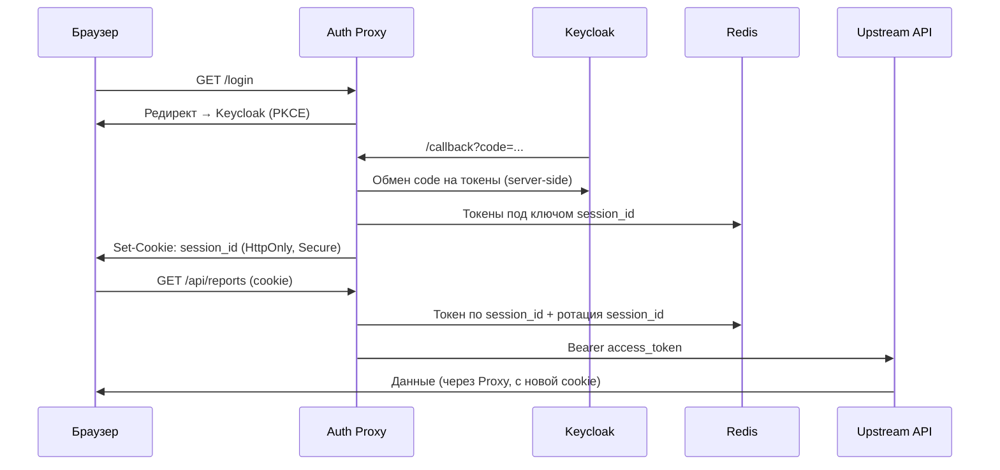
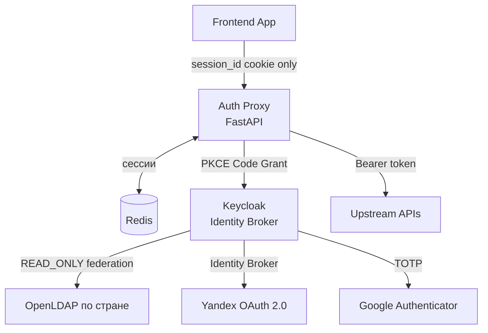

# Задание 1. Повышение безопасности системы

## Проблема

BionicPRO взломали, несмотря на OAuth 2.0 через Keycloak:

1. **ROPC-грант** (`directAccessGrantsEnabled: true`) — JS-приложение отправляет
   пароль напрямую в Keycloak, без браузерного редиректа.
2. **Токены в браузере** — access/refresh токены живут в памяти JS; при XSS
   злоумышленник просто читает их. Именно так утекли данные.
3. PKCE не настроен — перехваченный authorization code обменивается на токен.
4. Учётные данные хранятся локально — нарушение требований к data residency.
5. Нет поддержки внешних IdP для других стран.

## Решение — три слоя защиты

### 1. PKCE S256

Привязывает authorization code к браузеру, который его запросил: браузер
генерирует `code_verifier`, отправляет его хэш (`code_challenge`) при старте
флоу; обмен code на токен возможен только с оригинальным `code_verifier`.
Перехваченный код бесполезен.

Keycloak: отключить `directAccessGrantsEnabled`, включить
`pkce.code.challenge.method: S256`.

### 2. Auth Proxy (BFF) — токены не попадают в браузер

Новый сервис между браузером и остальной системой:

Ключевые свойства:

- **HttpOnly + Secure + SameSite** cookie — XSS не может украсть сессию, CSRF заблокирован.
- **Ротация `session_id`** при каждом запросе — перехваченная cookie тут же недействительна.
- **Stateless** — все сессии в Redis; refresh_token зашифрован; масштабируется горизонтально.
- Единая точка входа для всех фронтендов (донастройка протеза, магазин, CRM).

Технология: **Python (FastAPI + authlib)** — скорость разработки критична,
производительность Auth Proxy не узкое место (нагрузка — на Telemetry API);
благодаря stateless-архитектуре можно переписать на Go/Rust без изменения схемы.

### 3. LDAP + внешние IdP

- **Data residency**: пароли пользователей хранятся в LDAP страны присутствия;
  Keycloak федерируется в режиме `READ_ONLY` — только проверяет учётные данные,
  ничего не копирует и не изменяет (ФЗ-152, GDPR).
- **Identity Broker**: приложение всегда общается только с Keycloak, а тот
  сам аутентифицирует через нужный IdP (Yandex OAuth 2.0, будущие SAML/OIDC).
  Новая страна = новый IdP в Keycloak, код приложений не меняется.
- **MFA**: обязательный TOTP (Google Authenticator) на уровне Keycloak.

## Итоговая архитектура

## Что изменилось по угрозам

| Угроза | До | После |
|---|---|---|
| XSS → кража токена | Токен в JS-памяти | Токен на сервере, в браузере только HttpOnly cookie |
| Перехват auth_code | Работает | Бесполезен без `code_verifier` (PKCE) |
| CSRF | Нет защиты | `SameSite` cookie |
| Угнанная сессия | Действует до истечения токена | Ротация — сразу невалидна |
| Data residency | Всё локально | LDAP в стране присутствия, READ_ONLY |
| Новый IdP | Переписывать приложение | Подключить в Keycloak, код не меняется |

## Диаграмма контейнеров

To-be: [`C4_Containers_to-be.drawio`](C4_Containers_to-be.drawio).
Новые контейнеры: **Auth Proxy** (FastAPI), **Redis**;
новые внешние сервисы: **LDAP**, **Yandex OAuth 2.0**, **Google Authenticator (MFA)**.
