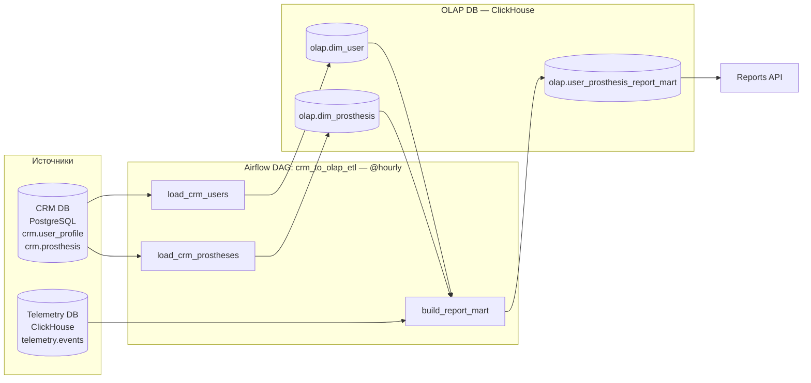
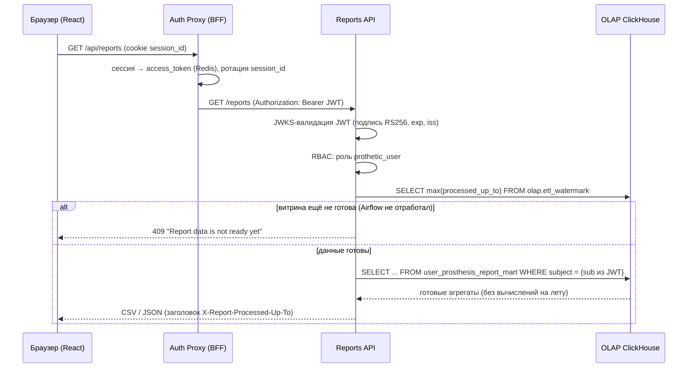

# Airflow DAG: ETL из CRM в OLAP и витрина для сервиса отчётов

## Задача

Пользователи хотят получать данные о работе своего протеза в виде отчёта.
Для этого нужен отдельный сервис отчётов (Reports API), который берёт данные
из **двух источников** — CRM и DB (телеметрия). Чтобы Reports API не ходил в
операционные базы, данные заранее собираются в OLAP-базу (ClickHouse):

1. Реализовать ETL-процесс на Airflow: извлечь данные из CRM-системы и
   записать их в OLAP-базу.
2. Подготовить **витрину** — отдельную таблицу для сервиса отчётов,
   объединяющую аналитику по телеметрии (в разрезе клиентов) с данными
   о клиентах из CRM. Структура витрины должна обеспечивать быстрый доступ
   к данным по пользователям.
3. Настроить расписание сбора данных и подготовки витрины.

Изменения в архитектуре — в [`C4_Containers_to-be.drawio`](C4_Containers_to-be.drawio)
(новые контейнеры: **Reports API**, **OLAP Data Import** (ETL, Airflow DAG),
**OLAP DB** (ClickHouse)).

---

## Архитектура ETL



Граф задач DAG:

```
init_olap_schema ──► load_crm_users ──────────┐
                 └─► load_crm_prostheses ─────┴─► build_report_mart
```

| Задача | Что делает |
|---|---|
| `init_olap_schema` | Идемпотентно создаёт БД `olap` и таблицы (DDL `IF NOT EXISTS`) |
| `load_crm_users` | **E**xtract из PostgreSQL (`crm.user_profile`) → **L**oad в `olap.dim_user` |
| `load_crm_prostheses` | Extract из PostgreSQL (`crm.prosthesis`) → Load в `olap.dim_prosthesis` |
| `build_report_mart` | **T**ransform: агрегирует `telemetry.events` по дням в разрезе (клиент, протез) и JOIN-ит с CRM-измерениями → витрина |

Код DAG: [`airflow/dags/crm_to_olap_etl.py`](../airflow/dags/crm_to_olap_etl.py).

---

## Витрина `olap.user_prosthesis_report_mart`

Одна строка = один день работы одного протеза одного клиента.

| Колонка | Тип | Смысл |
|---|---|---|
| `subject` | String | `sub` пользователя из Keycloak — **ключ доступа** Reports API |
| `prosthesis_serial` | String | серийный номер протеза |
| `event_date` | Date | день агрегации |
| `display_name`, `email` | String | атрибуты клиента (денормализованы из CRM) |
| `model`, `firmware_version` | String | атрибуты протеза из CRM |
| `events_count` | UInt64 | всего событий телеметрии за день |
| `avg_response_ms`, `p95_response_ms`, `max_response_ms` | Float32 | скорость реагирования протеза (цель < 100 мс) |
| `slow_events_count` | UInt64 | событий с реакцией > 100 мс |
| `avg_signal_quality` | Float32 | среднее качество миосигнала (0..1) |
| `min_battery_level` | UInt8 | минимальный заряд батареи за день, % |
| `movements_count` | UInt64 | распознанных движений |
| `first_event_at`, `last_event_at` | DateTime | границы активности за день |
| `loaded_at` | DateTime | версия строки (для ReplacingMergeTree) |

### Почему такая структура — быстрый доступ по пользователям

```sql
ENGINE = ReplacingMergeTree(loaded_at)
PARTITION BY toYYYYMM(event_date)
ORDER BY (subject, prosthesis_serial, event_date)
```

- **`ORDER BY (subject, …)`** — первичный ключ начинается с идентификатора
  пользователя. Основной запрос Reports API
  (`WHERE subject = :sub AND event_date BETWEEN …`) читает только гранулы
  одного пользователя, а не всю таблицу. Это же обеспечивает требование
  безопасности: сервис фильтрует по `sub` из JWT, и данные других
  пользователей физически не попадают в выборку.
- **Денормализация** атрибутов клиента и протеза — отчёт строится одним
  запросом к одной таблице, без JOIN-ов в момент чтения.
- **Дневная агрегация** — витрина на порядки меньше сырой телеметрии
  (~10⁴ событий/день/устройство → 1 строка), отчёт за месяц = ≤31 строка
  на протез.
- **`PARTITION BY` месяц** — отчёты запрашиваются за период; старые партиции
  дёшево удалять/архивировать (retention для медицинских данных).
- **`ReplacingMergeTree(loaded_at)`** — идемпотентность ETL: повторная
  загрузка окна не создаёт дубликатов, выживает строка с максимальным
  `loaded_at`.

---

## Расписание

| Что | Как настроено |
|---|---|
| Сбор данных из CRM + подготовка витрины | `schedule="@hourly"` в DAG `crm_to_olap_etl` |
| Окно пересчёта витрины | скользящее, `MART_WINDOW_DAYS=2` дня назад от логической даты |
| Защита от параллельных пересчётов | `max_active_runs=1`, `catchup=False` |
| Надёжность | `retries=2`, `retry_delay=5m` |

Почему `@hourly`: компания перешла на сбор телеметрии **в режиме реального
времени**, пользователи ждут свежих отчётов — суточная выгрузка устарела.
Час — компромисс между свежестью и нагрузкой на CRM/ClickHouse.
Скользящее окно в 2 дня закрывает «поздние» события (протез был офлайн
и отправил телеметрию позже) — они попадут в витрину при следующих запусках.

Сбор данных и подготовка витрины объединены в один DAG с явной зависимостью
`load_* → build_report_mart`: витрина никогда не строится по устаревшим
измерениям CRM.

---

## Новые компоненты в docker-compose

| Сервис | Порт | Назначение |
|---|---|---|
| `clickhouse` | 8123 / 9000 | БД `telemetry` (источник, сеется демо-данными) + БД `olap` (витрина) |
| `airflow_db` | — | PostgreSQL с метаданными Airflow |
| `airflow-init` | — | одноразовая инициализация (миграции + admin/admin) |
| `airflow-scheduler` | — | планировщик (LocalExecutor) |
| `airflow-webserver` | 8082 | UI Airflow — <http://localhost:8082> (admin/admin) |

Также к `crm_db` подключён init-скрипт
[`crm-db/init/01_crm_seed.sql`](../crm-db/init/01_crm_seed.sql):
таблица `crm.prosthesis` (реестр протезов) + демо-клиенты. Телеметрия сеется
скриптом [`clickhouse/init/01_telemetry_schema_and_seed.sql`](../clickhouse/init/01_telemetry_schema_and_seed.sql)
(3 протеза × 7 дней событий). `subject`-ы в обоих сидах совпадают.

> ⚠️ Init-скрипты Postgres/ClickHouse выполняются только при **первом** старте
> (пустые тома). Если стек уже запускался: `docker-compose down -v` (данные
> Keycloak в `./postgres-keycloak-data` при этом тоже потребуют переимпорта —
> см. корневой README).

---

## Как проверить

```bash
# 1. Поднять аналитический контур
docker-compose up -d clickhouse crm_db airflow_db airflow-init \
                     airflow-scheduler airflow-webserver

# 2. Дождаться, пока webserver ответит (1–2 мин: pip-зависимости + миграции)
curl -sf http://localhost:8082/health

# 3. Включить и запустить DAG (или через UI http://localhost:8082, admin/admin)
docker exec bionicpro-airflow-scheduler airflow dags unpause crm_to_olap_etl
docker exec bionicpro-airflow-scheduler airflow dags trigger crm_to_olap_etl

# 4. Статус запусков
docker exec bionicpro-airflow-scheduler airflow dags list-runs -d crm_to_olap_etl

# 5. Проверить измерения CRM в OLAP
docker exec bionicpro-clickhouse clickhouse-client \
  -u etl_user --password etl_password \
  -q "SELECT subject, display_name, email FROM olap.dim_user FINAL"

# 6. Проверить витрину: агрегаты телеметрии в разрезе клиентов
docker exec bionicpro-clickhouse clickhouse-client \
  -u etl_user --password etl_password \
  -q "SELECT subject, prosthesis_serial, event_date, events_count,
             round(avg_response_ms, 1) AS avg_ms, slow_events_count,
             display_name, model
      FROM olap.user_prosthesis_report_mart FINAL
      ORDER BY subject, event_date
      FORMAT PrettyCompact"

# 7. Запрос «как Reports API» — данные только одного пользователя
docker exec bionicpro-clickhouse clickhouse-client \
  -u etl_user --password etl_password \
  -q "SELECT event_date, events_count, round(p95_response_ms,1) AS p95_ms,
             min_battery_level
      FROM olap.user_prosthesis_report_mart FINAL
      WHERE subject = '11111111-1111-1111-1111-111111111111'
      ORDER BY event_date FORMAT PrettyCompact"
```

✅ Ожидание: DAG `crm_to_olap_etl` виден в UI с расписанием `@hourly`,
запуск проходит успешно (4 задачи), в `olap.dim_user` — 3 клиента из CRM,
в витрине — дневные агрегаты телеметрии по каждому клиенту, запрос по
конкретному `subject` возвращает только его строки.


# Reports API — бэкенд генерации отчётов из OLAP

## Задача

Создать бэкенд-часть приложения для API. Добавить API `/reports` для передачи
отчётов, который возвращает **подготовленный** отчёт по заданному пользователю.
Отчёт запрашивается из OLAP-базы **без сложных вычислений в реальном времени**.

Требования безопасности:

- отчёт не генерируется неаутентифицированному пользователю;
- авторизованный пользователь получает **только собственный** отчёт;
- отчёты строятся только за период, **уже обработанный Airflow** (пользователь
  может запросить данные, которых ещё нет в OLAP).

## Решение

Новый сервис [`reports-api`](../reports-api/) — Python (FastAPI), контейнер
`reports-api:8080` (наружу — `localhost:8091`). Это тот самый upstream,
на который Auth Proxy уже проксирует `/api/*`
(`UPSTREAM_API_URL: http://reports-api:8080`).



### `GET /reports`

| Параметр | По умолчанию | Описание |
|---|---|---|
| `days` | 30 | период отчёта (1–365 дней) |
| `format` | `csv` | `csv` (файл-attachment) или `json` |
| `subject` | — | только для роли `administrator`: отчёт другого пользователя (поддержка клиентов) |

Ответы: `200` (отчёт), `401` (нет/просрочен токен), `403` (нет роли или чужой
`subject`), `409` (ETL ещё не подготовил витрину), `503` (OLAP недоступен).

### Как выполняются требования

**1. Без вычислений в реальном времени.** Сервис читает готовые строки витрины
`olap.user_prosthesis_report_mart` (дневные агрегаты, подготовленные DAG-ом
`crm_to_olap_etl` из Задания 2). Запрос — точечная выборка по первичному ключу
витрины `ORDER BY (subject, prosthesis_serial, event_date)`: ClickHouse читает
только гранулы конкретного пользователя. Никаких `GROUP BY` по сырой
телеметрии в момент запроса.

**2. Только аутентифицированные.** Запросы приходят через Auth Proxy, который
подставляет Bearer JWT из серверной сессии (браузер токенов не видит).
Reports API — resource server: проверяет подпись RS256 по JWKS Keycloak,
`exp` и `iss` ([`reports-api/app/auth.py`](../reports-api/app/auth.py)).
Без валидного токена — `401`.

**3. Только собственный отчёт.** Идентификатор пользователя **не принимается
из запроса** — берётся claim `sub` из проверенного JWT. RBAC: нужна
realm-роль `prothetic_user`. Попытка запросить `?subject=<чужой>` без роли
`administrator` → `403`. Администратор может смотреть отчёты пользователей
(поддержка клиентов) — это отдельная привилегированная роль.

**4. Только обработанный Airflow период.** DAG после успешной сборки витрины
записывает **водяной знак** в `olap.etl_watermark` (`processed_up_to` =
логическая дата запуска). Reports API:
- если водяного знака нет (ETL ещё ни разу не отработал) → `409`,
  фронтенд показывает «Отчёт ещё не готов, попробуйте позже»;
- иначе верхняя граница отчёта прижимается к водяному знаку:
  `date_to = min(today, watermark)` — данные, которых ещё нет в OLAP,
  в отчёт не попадают (не отдаём неполный «сегодняшний» срез);
- фактическая актуальность отдаётся клиенту в заголовке
  `X-Report-Processed-Up-To` (и в поле `processed_up_to` для JSON).

### UI

Кнопка **Download Report** уже есть в
[`frontend/src/components/ReportPage.tsx`](../frontend/src/components/ReportPage.tsx):
вызывает `GET /api/reports` через Auth Proxy (только `credentials: 'include'`,
без токенов в JS) и скачивает CSV. Добавлена обработка:
- `401` → сброс сессии, предложение войти заново;
- `403` → «отчёты доступны только пользователям протезов и только свои»;
- `409` → «данные ещё обрабатываются (ETL), попробуйте позже».

## Как проверить

```bash
docker-compose up -d --build
# дождаться Keycloak (импорт realm) и Airflow (см. Task2/README.md)

# 1. Прогнать ETL, чтобы появился водяной знак и данные витрины
docker exec bionicpro-airflow-scheduler airflow dags unpause crm_to_olap_etl
docker exec bionicpro-airflow-scheduler airflow dags trigger crm_to_olap_etl

# 2. Без токена — 401
curl -i http://localhost:8091/reports

# 3. Через UI: http://localhost:3000 → Login (prothetic1/prothetic123 + OTP)
#    → Download Report → скачивается prosthesis-report-*.csv
#    (если DAG ещё не отработал — сообщение «Отчёт ещё не готов»)

# 4. Пользователь БЕЗ роли prothetic_user (user1/password123) → 403

# 5. Убедиться, что данные фильтруются по sub:
#    в CSV — только протезы текущего пользователя
```

> Демо-данные: сиды CRM/телеметрии используют фиксированные `subject`
> (`1111…`, `2222…`, `3333…`). Чтобы увидеть непустой отчёт под реальным
> пользователем Keycloak, добавьте телеметрию с его `sub`
> и перезапустите DAG — либо проверяйте выборку напрямую запросом к витрине.
