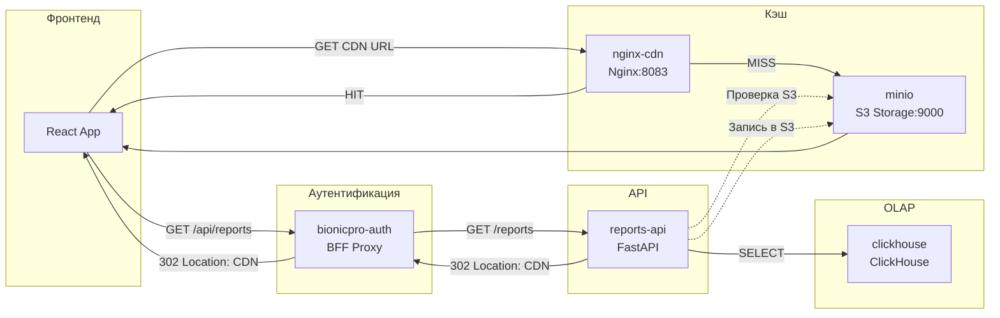

# Task 3: Кэширование отчётов в S3 + CDN

## Проблема

После внедрения пользовательской отчётности нагрузка на OLAP-базу (ClickHouse) существенно возросла. Пользователи часто запрашивают свои отчёты, но поскольку данные обновляются ETL-процессом по расписанию, на эти повторные запросы пользователи получают одинаковые данные.

## Решение

Добавлен механизм кэширования сформированных отчётов в объектное хранилище S3 (Minio) с раздачей через CDN (Nginx reverse proxy с кэшированием).

### Архитектура



### Поток запроса отчёта

1. **Клиент** запрашивает отчёт через фронтенд → `bionicpro-auth` → `reports-api`.
2. **reports-api** проверяет наличие отчёта в S3 по ключу `{subject}/{date_from}_{date_to}.{format}`:
   - **Если отчёт есть в S3**: возвращает HTTP 302 с `Location` на CDN URL.
   - **Если отчёта нет**: генерирует отчёт из ClickHouse, сохраняет в S3, возвращает HTTP 302 на CDN.
3. **bionicpro-auth** пробрасывает редирект клиенту.
4. **Клиент** следует по редиректу на CDN (Nginx).
5. **Nginx** проверяет локальный кэш:
   - **HIT**: отдаёт закэшированный файл.
   - **MISS**: запрашивает файл у Minio, кэширует и отдаёт клиенту.

### Структура хранения в S3

```
bionicpro-reports/          # бакет
├── {subject}/              # папка пользователя (sub из JWT)
│   ├── 2024-01-01_2024-01-31.csv
│   ├── 2024-01-01_2024-01-31.json
│   ├── 2024-02-01_2024-02-28.csv
│   └── ...
└── ...
```

Ключ объекта: `{subject}/{date_from}_{date_to}.{format}`

Такая структура обеспечивает:
- **Быстрый поиск** по пользователю (prefix listing).
- **Уникальность** по периоду и формату.
- **Простую инвалидацию** (удаление по префиксу или конкретному ключу).

### Механизм инвалидации кеша CDN

#### Автоматическая инвалидация
- Каждый объект в S3 получает `Cache-Control: max-age=3600, public` (1 час).
- Nginx кэширует ответ на 1 час (`proxy_cache_valid 200 1h`).
- После истечения TTL Nginx автоматически запросит обновлённый файл у Minio.

#### Ручная инвалидация (после ETL)
Администратор может удалить устаревшие отчёты из S3 через API:

```bash
# Удалить все отчёты пользователя за конкретный период
DELETE /reports/cache?subject={sub}&date_from=2024-01-01&date_to=2024-01-31

# Удалить все отчёты пользователя (любые периоды и форматы)
DELETE /reports/cache?subject={sub}
```

После удаления из S3:
1. Следующий запрос клиента сгенерирует новый отчёт из ClickHouse.
2. Nginx кэш инвалидируется по истечении TTL (или можно сделать `nginx -s reload`).

#### Для production
В продакшене рекомендуется использовать CDN с API purge (CloudFront, Cloudflare):
- После ETL-обновления вызвать `cf.purge()` для удаления устаревших URL.
- Или использовать shorter TTL + versioning в ключах S3.

## Развёртывание

### Новые сервисы в docker-compose

| Сервис | Порт | Описание |
|--------|------|----------|
| `minio` | 9002 (API), 9003 (Console) | S3-совместимое объектное хранилище |
| `nginx-cdn` | 8083 | Reverse proxy с кэшированием |

### Доступ к Minio Console
http://localhost:9001 (логин: `minioadmin`, пароль: `minioadmin`)

### Проверка работы

```bash
# 1. Запустить стек
docker-compose up -d minio nginx-cdn reports-api bionicpro-auth

# 2. Проверить health endpoints
curl http://localhost:8083/health        # Nginx CDN
curl http://localhost:9003/minio/health/live  # Minio

# 3. Запросить отчёт (первый раз — генерация + запись в S3)
curl -v -b session=... http://localhost:8000/api/reports
# Ответ: HTTP 302 → Location: http://localhost:8083/bionicpro-reports/...

# 4. Повторный запрос (должен прийти из кэша)
curl -v -b session=... http://localhost:8000/api/reports
# Ответ: HTTP 302 → тот же CDN URL

# 5. Проверить X-Cache-Status в ответе Nginx
curl -I http://localhost:8083/bionicpro-reports/...
# X-Cache-Status: HIT (или MISS при первом запросе)
```

## Изменённые файлы

| Файл | Изменение |
|------|-----------|
| `docker-compose.yaml` | Добавлены сервисы `minio`, `nginx-cdn`; обновлён `reports-api` |
| `reports-api/requirements.txt` | Добавлена зависимость `boto3` |
| `reports-api/app/config.py` | Добавлены настройки S3 и CDN |
| `reports-api/app/main.py` | Логика кэширования: проверка S3, upload, редирект на CDN, инвалидация |
| `bionicpro-auth/app/main.py` | Проброс Location и кастомных заголовков при редиректах |
| `nginx-cdn.conf` | Конфигурация Nginx как CDN reverse proxy с кэшированием |

## Безопасность

- Отчёты в S3 хранятся по `subject` (внутренний идентификатор из JWT), что затрудняет угадывание URL.
- Доступ к отчётам контролируется на уровне `reports-api`: пользователь может запросить только свой отчёт (администратор — любой).
- CDN (Nginx) не имеет собственной аутентификации, но URL отчётов непредсказуемы и ограничены по времени жизни (TTL 1 час).
- Для production рекомендуется добавить подписанные URL (presigned URLs) с ограниченным временем действия.
