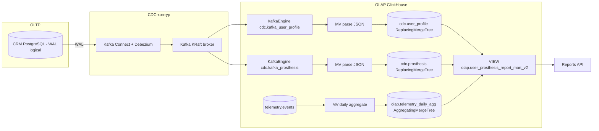

# Task 4: CDC (Debezium → Kafka → ClickHouse)

## Проблема

Batch-выгрузки Airflow из CRM (PostgreSQL) нагружали OLTP-базу: массовые
`SELECT * FROM crm.*` каждый час конкурировали с транзакционными запросами CRM.
CDC-контур решает это разделением потоков: транзакции остаются в CRM, а изменения
данных доставляются в OLAP потоково через WAL, не нагружая источник.

## Архитектура



Поток данных:
1. `INSERT/UPDATE/DELETE` в CRM-таблицы → PostgreSQL WAL (logical replication)
2. Debezium читает WAL через слот `crm_cdc_slot` и публикует события в Kafka
3. KafkaEngine-таблицы ClickHouse консюмят JSON из топиков
4. MaterializedView раскладывает JSON в ReplacingMergeTree-измерения
5. Агрегаты телеметрии обновляются через второй MV
6. VIEW `olap.user_prosthesis_report_mart_v2` объединяет измерения с агрегатами
7. Reports API читает готовую витрину

## Топики Kafka

| Топик | Источник | Формат |
|---|---|---|
| `crm.crm.user_profile` | Debezium (таблица `crm.user_profile`) | JSON (ExtractNewRecordState) |
| `crm.crm.prosthesis` | Debezium (таблица `crm.prosthesis`) | JSON (ExtractNewRecordState) |

Каждое сообщение содержит поля:
- Все колонки таблицы (плоский JSON, без вложенной схемы)
- `__op` — операция: `c` (create), `u` (update), `d` (delete)
- `__ts_ms` — миллисекунды эпохи (монотонный версионный штамп)
- `__deleted` — `true` для DELETE (благодаря `delete.handling.mode=rewrite`)

## Схема ClickHouse

### База `cdc` — CDC-измерения

**KafkaEngine-таблицы** (потребители топиков):
- `cdc.kafka_user_profile` — ENGINE=Kafka('kafka:9092', 'crm.crm.user_profile', 'clickhouse-cdc-user-profile')
- `cdc.kafka_prosthesis` — ENGINE=Kafka('kafka:9092', 'crm.crm.prosthesis', 'clickhouse-cdc-prosthesis')

**ReplacingMergeTree-таблицы** (версионированные измерения):
- `cdc.user_profile` — ORDER BY (subject), версия `__ts_ms`, флаг `is_deleted`
- `cdc.prosthesis` — ORDER BY (serial_number), версия `__ts_ms`, флаг `is_deleted`

**MaterializedView** (Kafka → целевая таблица):
- `cdc.mv_user_profile` — парсинг дат `parseDateTimeBestEffortOrZero`, фильтр `__ts_ms > 0`
- `cdc.mv_prosthesis` — аналогично

### База `olap` — агрегаты и витрина

**AggregatingMergeTree**:
- `olap.telemetry_daily_agg` — суточные метрики по (subject, prosthesis_serial, event_date)
  - states: count, avg, quantile(0.95), max, countIf(>100), avg signal, min battery, countIf(movement), min/max time

**MaterializedView**:
- `olap.mv_telemetry_daily_agg` — `telemetry.events` → `olap.telemetry_daily_agg` (новые вставки)

**VIEW**:
- `olap.user_prosthesis_report_mart_v2` — финализация агрегатов (`-Merge` функции) + JOIN
  с `cdc.user_profile FINAL` и `cdc.prosthesis FINAL`, фильтр `is_deleted = 0`

## Механизм версионирования (ReplacingMergeTree)

- Каждая строка в Kafka-сообщении содержит `__ts_ms` — миллисекунды эпохи
  (выставляется Debezium в момент захвата изменения из WAL)
- ReplacingMergeTree(__ts_ms) при финализации оставляет строку с максимальным `__ts_ms`
  для каждого ключа сортировки
- DELETE обрабатывается через `ExtractNewRecordState` с `delete.handling.mode=rewrite`:
  Debezium превращает DELETE в INSERT со всеми полями и `__deleted=true`
- В MV `is_deleted` вычисляется как `if(__deleted, 1, 0)`
- Витрина фильтрует `is_deleted = 0`

## Обработка DELETE

1. DELETE в CRM → WAL → Debezium получает событие удаления
2. `ExtractNewRecordState` с `delete.handling.mode=rewrite` превращает DELETE
   в INSERT с теми же полями + `__deleted=true`
3. Kafka → KafkaEngine → MV → ReplacingMergeTree с `is_deleted=1`
4. При финализации (FINAL) строка с `is_deleted=1` может быть старше
   (по `__ts_ms`) или новее — витрина всегда фильтрует `is_deleted = 0`

## Сервисы docker-compose

| Сервис | Образ | Назначение |
|---|---|---|
| `kafka` | confluentinc/cp-kafka:7.7.0 | KRaft-брокер (broker+controller), порт 9092 (внутренний) |
| `kafka-connect` | debezium/connect:2.7.3.Final (кастомный) | Kafka Connect + Debezium, инициализация коннектора при старте, REST API :8084 |
| `kafka-ui` | provectuslabs/kafka-ui:latest | Веб-интерфейс Kafka (топики, сообщения, коннекторы) |
| `clickhouse-cdc-init` | clickhouse/clickhouse-server:24.3 | Одноразовое применение CDC-схемы |
| `clickhouse-ui` | elestio/clickhouse-ui:latest | Веб-интерфейс ClickHouse (SQL-запросы, reverse proxy к CH) |

## Изменения в существующих сервисах

### CRM DB (`crm_db`)
- Добавлен `command: ["postgres", "-c", "wal_level=logical"]`
- Debezium создаёт publication и slot автоматически

### Reports API (`reports-api`)
- Читает из `olap.user_prosthesis_report_mart_v2` вместо `olap.user_prosthesis_report_mart`
- Водяной знак: `maxMerge(last_event_at)` из `olap.telemetry_daily_agg`
  (вместо `olap.etl_watermark` от Airflow)
- VIEW уже финализирован — запросы без FINAL

### Airflow
- DAG `crm_to_olap_etl` больше не нужен для CRM-данных (CDC заменяет batch-выгрузку)
- Контейнеры Airflow можно оставить (не удаляются)

## Порты

| Сервис | Хост-порт | Примечание |
|---|---|---|
| kafka | — | только внутренняя сеть, kafka:9092 |
| kafka-connect | 8084 | REST API Debezium (8083 занят minio-nginx) |
| kafka-ui | 8085 | Веб-интерфейс Kafka (топики, сообщения, Connect) |
| clickhouse-ui | 8086 | Веб-интерфейс ClickHouse (SQL-запросы) |
| остальные | без изменений | |

## Инструкция по проверке

### 1. Запуск

```bash
docker-compose up -d --build
```

Убедиться, что все сервисы healthy:
- `kafka` — healthcheck через `kafka-topics --list`
- `kafka-connect` — инициализация коннектора внутри контейнера (см. логи)
- `clickhouse-cdc-init` — завершился успешно (CDC schema applied)

### 2. Проверка через веб-интерфейсы

**Kafka UI** — http://localhost:8085
- Вкладка **Topics** — проверить наличие топиков `crm.crm.user_profile` и `crm.crm.prosthesis`
- Вкладка **Connect** — проверить статус коннектора `crm-connector` (должен быть RUNNING)
- Вкладка **Messages** — просмотреть сообщения в топике

**ClickHouse UI** — http://localhost:8086
- Параметры подключения (заполняются автоматически из env):
  - Host: `clickhouse`, Port: `8123`, User: `etl_user`, Password: `etl_password`
- Выполнить запрос для проверки CDC-таблиц:
  ```sql
  SELECT name, engine FROM system.tables WHERE database IN ('cdc', 'olap')
  ```

### 3. Проверка коннектора через REST API

```bash
curl http://localhost:8084/connectors/crm-connector/status | jq .
```

Ожидается: `"state": "RUNNING"`

### 4. Проверка CDC: INSERT в CRM → ClickHouse

Вставить строку в CRM:
```bash
docker exec -i bionicpro-crm-db psql -U crm_user -d crm_db <<EOF
INSERT INTO crm.user_profile (subject, provider, external_id, username, display_name, email)
VALUES ('test-cdc-001', 'keycloak', '9999', 'cdc.test', 'CDC Test', 'cdc@test.com');
EOF
```

Проверить появление в ClickHouse (через несколько секунд):

**Через UI** — http://localhost:8086 → выполнить:
```sql
SELECT subject, username, display_name, email, is_deleted
FROM cdc.user_profile FINAL
WHERE subject = 'test-cdc-001'
```

**Через CLI:**
```bash
docker exec -i bionicpro-clickhouse clickhouse-client -u etl_user --password etl_password --query "
SELECT subject, username, display_name, email, is_deleted
FROM cdc.user_profile FINAL
WHERE subject = 'test-cdc-001'
FORMAT PrettyCompact
"
```

### 5. Проверка DELETE

```bash
docker exec -i bionicpro-crm-db psql -U crm_user -d crm_db <<EOF
DELETE FROM crm.user_profile WHERE subject = 'test-cdc-001';
EOF
```

Проверить `is_deleted = 1` через UI или CLI:
```sql
SELECT subject, is_deleted, __ts_ms
FROM cdc.user_profile FINAL
WHERE subject = 'test-cdc-001'
```

### 6. Проверка витрины отчётов

**Через UI** — http://localhost:8086:
```sql
SELECT subject, prosthesis_serial, event_date, events_count, avg_response_ms
FROM olap.user_prosthesis_report_mart_v2
WHERE subject = '11111111-1111-1111-1111-111111111111'
LIMIT 5
```

**Через CLI:**
```bash
docker exec -i bionicpro-clickhouse clickhouse-client -u etl_user --password etl_password --query "
SELECT subject, prosthesis_serial, event_date, events_count, avg_response_ms
FROM olap.user_prosthesis_report_mart_v2
WHERE subject = '11111111-1111-1111-1111-111111111111'
LIMIT 5
FORMAT PrettyCompact
"
```

### 7. Проверка Reports API

```bash
curl -s http://localhost:8091/reports?days=7 \
  -H "Authorization: Bearer $(TOKEN)" | jq .
```

## Сравнение нагрузки

| До (Airflow batch) | После (CDC) |
|---|---|
| `SELECT * FROM crm.user_profile` каждый час | WAL-репликация, нет SELECT |
| `SELECT * FROM crm.prosthesis` каждый час | WAL-репликация, нет SELECT |
| Конкуренция с транзакционными запросами CRM | Нулевое влияние на OLTP |
| Задержка до 1 часа (по расписанию DAG) | Задержка секунды (почти realtime) |

## Критерии приёмки

1. `docker-compose up` поднимает kafka, kafka-connect; коннектор в состоянии RUNNING
2. INSERT/UPDATE/DELETE в `crm.user_profile` / `crm.prosthesis` появляются
   в `cdc.*` таблицах ClickHouse без участия Airflow
3. `olap.user_prosthesis_report_mart_v2` отдаёт те же колонки, что старая витрина
4. Reports API возвращает отчёт из новой витрины (JSON, S3-кэш работает как в Task 3)
