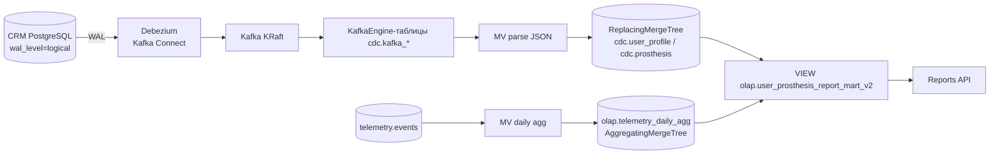

# Задание 4. CDC: Debezium → Kafka → ClickHouse

## Проблема

Batch-выгрузки Airflow (`SELECT * FROM crm.*` каждый час) конкурировали с
транзакционными запросами CRM. CDC решает это: изменения доставляются в OLAP
потоково через WAL, не нагружая источник, с задержкой в секунды вместо часа.

## Архитектура



Поток: изменение в CRM → WAL → Debezium (слот `crm_cdc_slot`) → топики
`crm.crm.user_profile`, `crm.crm.prosthesis` → KafkaEngine → MV →
ReplacingMergeTree → VIEW-витрина.

## Формат сообщений Kafka

`ExtractNewRecordState` с `add.fields=op,ts_ms`, `add.fields.prefix="__"`,
`delete.handling.mode=rewrite`. Плоский JSON:

- все колонки таблицы;
- `__ts_ms` — миллисекунды эпохи (версия строки для ReplacingMergeTree);
- `__deleted` — **строка** `"true"`/`"false"` (не boolean!);
- `op` — операция `c`/`u`/`d`/`r` (**без** префикса `__`).

> ⚠️ Тонкости, выявленные при отладке:
> - `__deleted` приходит строкой → в схеме KafkaEngine тип `String`,
>   в MV `if(__deleted = 'true', 1, 0)`.
> - Nullable-поля CRM (first_name и т.д.) → `Nullable(String)` +
>   `input_format_skip_unknown_fields=1` (пропуск `raw_profile`).
> - Для DELETE PostgreSQL по умолчанию пишет в WAL только PK — нужно
>   `ALTER TABLE ... REPLICA IDENTITY FULL` (сделано в
>   [`crm-db/init/01_crm_seed.sql`](../crm-db/init/01_crm_seed.sql)),
>   иначе в событии удаления `subject` и другие поля пустые.

## Схема ClickHouse

Скрипт: [`clickhouse/cdc/02_cdc_kafka_olap.sql`](../clickhouse/cdc/02_cdc_kafka_olap.sql)
(применяет одноразовый сервис `clickhouse-cdc-init`).

| Объект | Назначение |
|---|---|
| `cdc.kafka_user_profile`, `cdc.kafka_prosthesis` | KafkaEngine-потребители топиков |
| `cdc.user_profile`, `cdc.prosthesis` | ReplacingMergeTree(`__ts_ms`), флаг `is_deleted` |
| `cdc.mv_*` | Kafka → целевые таблицы (парсинг дат, `is_deleted`) |
| `olap.telemetry_daily_agg` | AggregatingMergeTree: суточные метрики телеметрии |
| `olap.mv_telemetry_daily_agg` | `telemetry.events` → агрегаты |
| `olap.user_prosthesis_report_mart_v2` | VIEW: `-Merge`-финализация + JOIN c CDC-измерениями (`is_deleted = 0`) |

**DELETE**: rewrite-режим превращает удаление в INSERT с `__deleted="true"` →
строка с `is_deleted=1` и новым `__ts_ms` побеждает в ReplacingMergeTree;
витрина фильтрует `is_deleted = 0`.

MV срабатывают на каждую вставку из Kafka; KafkaEngine флашит батч примерно
каждые 7–8 с (`kafka_flush_interval_ms`) — данные видны в течение ~10 с.

## Сервисы docker-compose

| Сервис | Порт | Назначение |
|---|---|---|
| `kafka` (confluentinc/cp-kafka, KRaft) | внутр. 9092 | брокер |
| `kafka-connect` (debezium/connect 2.7.3.Final) | 8084 | Debezium + автоинициализация коннектора |
| `kafka-ui` | 8085 | веб-интерфейс Kafka |
| `clickhouse-cdc-init` | — | одноразовое применение CDC-схемы |
| `telemetry-api` | 8092 | FastAPI: запись телеметрии в ClickHouse |

Изменения: `crm_db` — `wal_level=logical`; `reports-api` читает
`olap.user_prosthesis_report_mart_v2` (водяной знак — `maxMerge(last_event_at)`);
Airflow DAG для CRM-данных больше не нужен.

## Проверка

```bash
docker-compose up -d --build
```

**1. Коннектор RUNNING** (или в Kafka UI <http://localhost:8085> → Connect):

```bash
curl -s http://localhost:8084/connectors/crm-connector/status | jq .connector.state
```

**2. Телеметрия через API:**

```bash
curl -X POST http://localhost:8092/telemetry/events -H "Content-Type: application/json" \
  -d '{"subject":"11111111-1111-1111-1111-111111111111","prosthesis_serial":"BP-ARM-0001",
       "event_type":"movement","response_time_ms":45,"signal_quality":0.87,"battery_level":85}'
```

**3. CDC INSERT:**

```bash
docker exec -i bionicpro-crm-db psql -U crm_user -d crm_db -c \
  "INSERT INTO crm.user_profile (subject,provider,external_id,username,display_name,email)
   VALUES ('test-cdc-001','keycloak','9999','cdc.test','CDC Test','cdc@test.com');"

# через ~10 секунд:
docker exec bionicpro-clickhouse clickhouse-client -u etl_user --password etl_password -q \
  "SELECT subject, display_name, is_deleted FROM cdc.user_profile FINAL
   WHERE subject='test-cdc-001' FORMAT PrettyCompact"
```

**4. CDC DELETE** (ожидаем `is_deleted = 1`):

```bash
docker exec -i bionicpro-crm-db psql -U crm_user -d crm_db -c \
  "DELETE FROM crm.user_profile WHERE subject='test-cdc-001';"

docker exec bionicpro-clickhouse clickhouse-client -u etl_user --password etl_password -q \
  "SELECT subject, is_deleted, __ts_ms FROM cdc.user_profile FINAL
   WHERE subject='test-cdc-001' FORMAT PrettyCompact"
```

**5. Витрина и Reports API:**

```bash
docker exec bionicpro-clickhouse clickhouse-client -u etl_user --password etl_password -q \
  "SELECT subject, prosthesis_serial, event_date, events_count
   FROM olap.user_prosthesis_report_mart_v2
   WHERE subject='11111111-1111-1111-1111-111111111111'
   ORDER BY event_date DESC LIMIT 5 FORMAT PrettyCompact"
```

## Итог: нагрузка на CRM

| До (Airflow batch) | После (CDC) |
|---|---|
| `SELECT *` из CRM каждый час | WAL-репликация, нулевое влияние на OLTP |
| Задержка до 1 часа | Секунды (near-realtime) |
