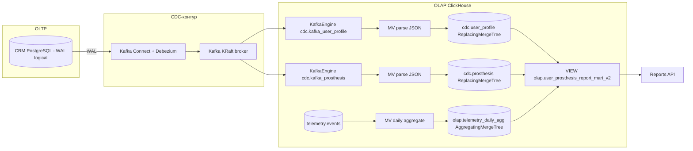

# Task 4: CDC (Debezium → Kafka → ClickHouse) — план

## Проблема

Batch-выгрузки Airflow из CRM (PostgreSQL) нагружают OLTP-базу: массовые
`SELECT * FROM crm.*` каждый час конкурируют с транзакционными запросами CRM.
Нужно разделить потоки: транзакции остаются в CRM, а изменения данных
доставляются в OLAP потоково через CDC, не нагружая источник.

## Целевая архитектура

Поток: `INSERT/UPDATE/DELETE` в CRM → WAL → Debezium публикует событие в топики
`crm.crm.user_profile` / `crm.crm.prosthesis` → KafkaEngine-таблицы ClickHouse
консюмят JSON → MaterializedView раскладывает в ReplacingMergeTree-измерения →
витрина-VIEW объединяет измерения с суточными агрегатами телеметрии.

## Шаги реализации

### 1. PostgreSQL: включить логическую репликацию
- `docker-compose.yaml`: у сервиса `crm_db` добавить
  `command: ["postgres", "-c", "wal_level=logical"]`.
- Debezium сам создаст publication (`publication.autocreate.mode=filtered`),
  slot `crm_cdc_slot`. Пользователь `crm_user` — суперпользователь контейнера,
  прав достаточно.
- Потребуется пересоздание контейнера БД (том сохраняется, wal_level применится
  при рестарте).

### 2. Kafka (KRaft, один брокер)
- Новый сервис `kafka` (bitnami/kafka:3.7): один узел, роли
  broker+controller, listener PLAINTEXT `kafka:9092` (внутренний), healthcheck
  через `kafka-topics.sh --list`.
- Хост-порт наружу не публикуем (нужен только внутри compose-сети).

### 3. Kafka Connect + Debezium
- Новый сервис `kafka-connect` (debezium/connect:2.7):
  `BOOTSTRAP_SERVERS=kafka:9092`, storage-топики config/offset/status,
  JSON-конвертеры с `schemas.enable=false`.
- REST API: хост-порт **8084** (8083 занят minio-nginx).
- Новый сервис `debezium-init` (curlimages/curl): ждёт готовность Connect
  и регистрирует коннектор из `debezium/crm-connector.json` (идемпотентно, PUT).

### 4. Конфиг коннектора `debezium/crm-connector.json`
- connector.class: `io.debezium.connector.postgresql.PostgresConnector`
- plugin.name: `pgoutput`, slot.name: `crm_cdc_slot`, topic.prefix: `crm`
- table.include.list: `crm.user_profile,crm.prosthesis`
- transforms: `unwrap` (ExtractNewRecordState) с
  `delete.handling.mode=rewrite`, `add.fields=op,ts_ms` — плоский JSON
  с полями `__op`, `__ts_ms`, `__deleted` для ClickHouse.

### 5. ClickHouse: CDC-приёмник (`clickhouse/cdc/02_cdc_kafka_olap.sql`)
- БД `cdc`:
  - `cdc.kafka_user_profile`, `cdc.kafka_prosthesis` — ENGINE=Kafka,
    `kafka_format='JSONEachRow'`, отдельные consumer group.
  - `cdc.user_profile`, `cdc.prosthesis` — ReplacingMergeTree(version)
    c `version = __ts_ms`, флаг `is_deleted` (обработка DELETE через rewrite).
  - MV `cdc.mv_user_profile`, `cdc.mv_prosthesis`: Kafka-таблица → целевая,
    парсинг дат `parseDateTimeBestEffortOrZero`.
- Агрегаты телеметрии:
  - `olap.telemetry_daily_agg` — AggregatingMergeTree
    (states: count, avg, quantile 0.95, max, countIf>100, min battery, ...)
    ORDER BY (subject, prosthesis_serial, event_date).
  - MV `olap.mv_telemetry_daily_agg`: `telemetry.events` → agg (новые вставки).
  - Одноразовый backfill существующих событий INSERT ... SELECT.
- Витрина: `VIEW olap.user_prosthesis_report_mart_v2` — финализация агрегатов
  (`-Merge` функции) + JOIN c `cdc.user_profile FINAL` и `cdc.prosthesis FINAL`,
  фильтр `is_deleted = 0`.
- Применение DDL: одноразовый сервис `clickhouse-cdc-init` в compose
  (клиент clickhouse, зависит от kafka и clickhouse healthy), идемпотентные
  `IF NOT EXISTS`.

### 6. Перевод Reports API на новую витрину
- `reports-api/app/main.py`:
  - `_fetch_report_rows` → читает `olap.user_prosthesis_report_mart_v2`
    (VIEW уже финализирован — без FINAL).
  - `_fetch_watermark` → свежесть данных теперь = `max(last_event_at)` из
    агрегата (CDC-поток почти realtime, Airflow-watermark больше не источник).
- Airflow DAG `crm_to_olap_etl` больше не нужен для CRM-данных — пометить
  как выключенный (pause / комментарий в README), контейнеры Airflow можно
  оставить.

### 7. Документация `Task4/README.md`
- Архитектура (mermaid), описание топиков, схем таблиц, механизма
  ReplacingMergeTree-версионирования по `__ts_ms`, обработка DELETE,
  инструкция проверки: INSERT в CRM → строка в ClickHouse через секунды,
  сравнение нагрузки (нет массовых SELECT из CRM).

## Порты (без конфликтов)

| Сервис | Хост-порт | Примечание |
|---|---|---|
| kafka | — | только внутренняя сеть, kafka:9092 |
| kafka-connect | 8084 | REST API Debezium (8083 занят minio-nginx) |
| остальные | без изменений | |

## Критерии приёмки
1. `docker-compose up` поднимает kafka, kafka-connect; коннектор в состоянии RUNNING.
2. INSERT/UPDATE/DELETE в `crm.user_profile` / `crm.prosthesis` появляются
   в `cdc.*` таблицах ClickHouse без участия Airflow.
3. `olap.user_prosthesis_report_mart_v2` отдаёт те же колонки, что старая витрина.
4. Reports API возвращает отчёт из новой витрины (JSON, S3-кэш работает как в Task 3).
